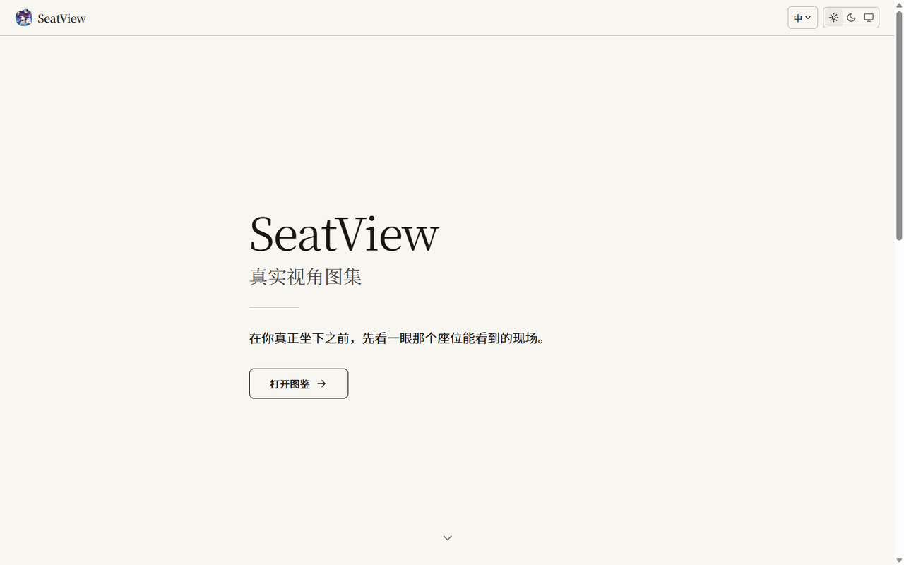
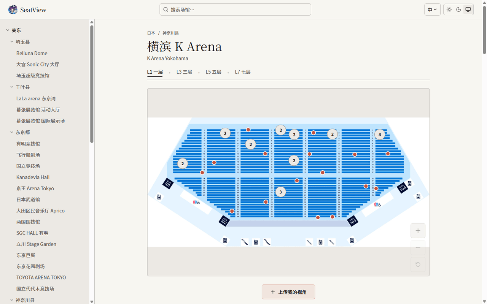
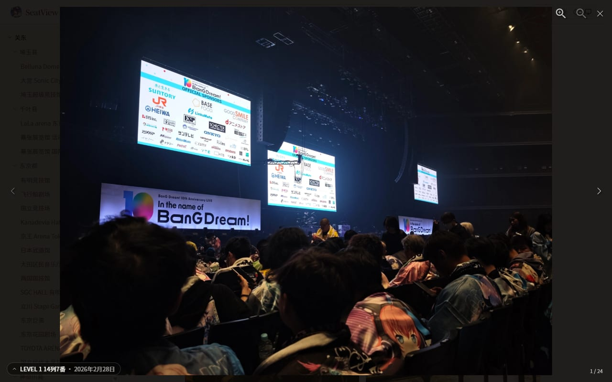
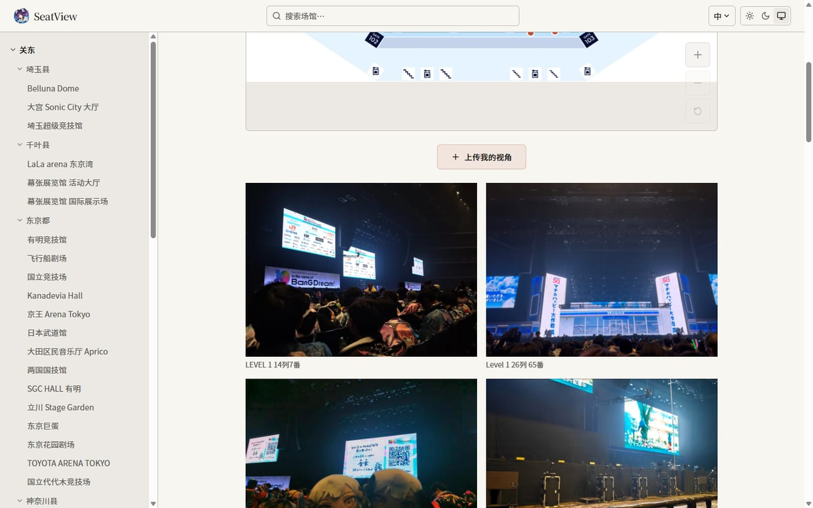
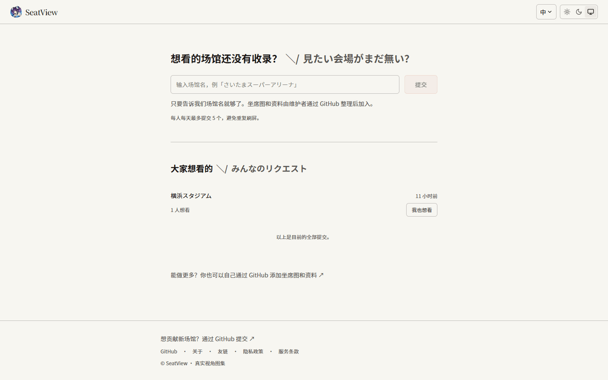
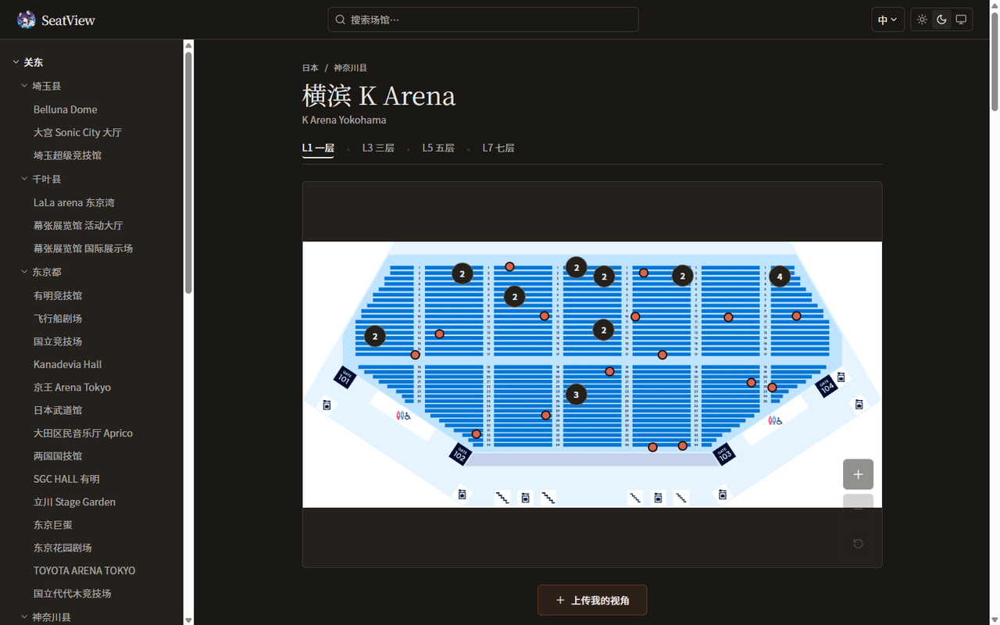

# SeatView

[](https://seat.genchi.top) [](LICENSE) [](https://github.com/Sallyn0225/seatview/actions/workflows/ci.yml)

<!-- README-I18N:START -->

[简体中文](./README.md) | [English](./README.en.md) | [日本語](./README.ja.md) | **한국어**

<!-- README-I18N:END -->

> 추첨이든, 티켓 전쟁이든, 공연 전 좌석 확인이든——그 좌석에서 실제로 무엇이 보이는지 먼저 확인하세요.
> リアル座席ビュー · 真实视角图集 —— 내부 코드네임 `seatmap-real`

**SeatView** 는 일본(일부 해외 포함) 콘서트 공연장의 **실제 좌석 시야 사진**을 모읍니다. 사용자는 공연장 공식 좌석도 위에 자신의 좌석을 표시하고 그 위치에서 찍은 실사 사진을 업로드합니다. 다른 사람은 좌석도의 마커를 클릭하면 그 좌석의 실제 시야를 Lightbox 에서 미리 볼 수 있어, 추첨이나 티켓 예매, 공연 전 좌석 확인 때 더 현명한 결정을 내릴 수 있습니다.

조회, 업로드, 익명 평점은 모두 **SeatView 회원 가입이 필요 없습니다**. 업로드는 IP 요청 빈도 제한 + Cloudflare Turnstile 로 남용을 방지하고, 평점은 공연장 + salt 처리된 IP hash 로 중복 제거와 제한을 적용합니다. 댓글은 giscus 를 통해 GitHub Discussions 에 연결됩니다. 전체 스택은 Cloudflare 한 곳에서만 동작합니다: Workers(SSR + 정적 자산) + D1 + KV + R2.

라이브 사이트 👉 **[seat.genchi.top](https://seat.genchi.top)**

[미리보기](#미리보기) · [기능](#기능) · [기술 스택](#기술-스택) · [빠른 시작](#빠른-시작) · [배포](#cloudflare-배포) · [작동 원리](#작동-원리) · [프로젝트 구조](#프로젝트-구조) · [기여](#기여)

## 미리보기

> 아래 스크린샷은 라이브 사이트 **[seat.genchi.top](https://seat.genchi.top)**(간체 중국어 · 라이트 테마)에서 가져온 것입니다.

<p align="center">
  
</p>

핵심 경험은 단 두 단계——**좌석도에서 좌석을 탭 → 그 좌석의 실제 시야 확인**:

<table>
  <tr>
    <th width="50%">① 좌석도 마커</th>
    <th width="50%">② 실제 시야 Lightbox</th>
  </tr>
  <tr>
    <td></td>
    <td></td>
  </tr>
  <tr>
    <td>공연장 공식 좌석도(다중 레이어 / 다중 구역 전환 지원) 위에서 다른 사용자가 표시한 좌석 포인트를 확인하고, 인접한 포인트는 자동으로 묶여 개수가 표시됩니다.</td>
    <td>마커나 썸네일을 클릭하면 그 좌석의 실사 사진 + 좌석 번호 / 텍스트 설명을 Lightbox 에서 볼 수 있습니다.</td>
  </tr>
</table>

<table>
  <tr>
    <th width="40%">③ 공연장의 모든 투고(워터폴)</th>
    <th width="32%">보고 싶은 공연장(크라우드소싱 임시 보관)</th>
    <th width="28%">다크 테마</th>
  </tr>
  <tr>
    <td></td>
    <td></td>
    <td></td>
  </tr>
  <tr>
    <td>좌석도 아래에 해당 공연장의 모든 실제 시야 투고를 masonry 워터폴로 표시합니다.</td>
    <td>보고 싶은 공연장이 없나요? 이름을 적으면 다른 사람들이 +1 로 찬성할 수 있습니다.</td>
    <td>라이트 / 다크 / 시스템 따름 3단계 테마 전환.</td>
  </tr>
</table>

## 기능

- **광역자치단체별 탐색** —— 왼쪽 공연장 트리는 일본 행정 구역으로 그룹화되어 접을 수 있습니다. Fuse.js 클라이언트 측 퍼지 검색으로 중국어 / 일본어 / 로마자 별칭까지 매칭됩니다.
- **좌석도 마킹** —— 공연장 공식 좌석도(다중 레이어 / 다중 구역 tag 전환 지원) 위에서 다른 사용자가 표시한 좌석 포인트를 확인하고, 인접한 포인트는 자동으로 묶여 개수가 표시됩니다.
- **실제 시야 Lightbox** —— 마커를 클릭하면 그 좌석의 실사 사진 + 좌석 번호 / 텍스트 설명을 볼 수 있습니다. 아래의 워터폴(masonry)에는 해당 공연장의 모든 투고가 표시됩니다.
- **공연장 댓글과 평점** —— 공연장 제목 영역의 조용한 진입점에 평균 점수 / 평점 수를 표시하고 오른쪽 드로어를 엽니다. 위쪽은 익명 1~5점 별점(다시 평가하면 점수 변경), 아래쪽은 `venue:<id>` 에 엄격하게 매핑된 giscus 댓글이며, 언어 경로와 좌석도 탭을 넘어 같은 토론을 공유합니다.
- **회원 가입 없는 업로드** —— 마킹(전체 화면 줌으로 정밀하게 배치하는 모드 제공) → 이미지 선택 → 클라이언트 측에서 WebP 로 압축(EXIF 제거) → HMAC ticket 의 2단계 제출. 완료되지 않은 단계는 인라인 안내로 유도하며, 전 과정에 IP 요청 빈도 제한 + Turnstile 남용 방지가 적용됩니다.
- **다국어 i18n** —— `/zh` `/ja` `/en` `/ko` 4개 프리픽스 라우팅, 루트 직하 `/` 는 `Accept-Language` 에 따라 자동 리다이렉트(`zh` / `ja` 는 대등한 두 축이며, `en` / `ko` 는 접근성을 위한 번역 레이어).
- **공연장 크라우드소싱** —— 사이트 내 「보고 싶은 공연장」 임시 보관 영역에서 +1(공개 득표 수 + 일일 요청 제한 + 동명 중복 제거)하거나, GitHub PR 로 공연장 JSON 을 직접 제출할 수 있습니다.
- **메인테이너 관리자** —— `/admin` 은 Cloudflare Access 의 엣지 인증으로 보호되며, 투고의 소프트 삭제를 지원합니다.

## 기술 스택

| 레이어 | 선택 | 설명 |
|---|---|---|
| 프런트엔드 프레임워크 | **Astro 6.3** + React 19 Islands | 대부분 정적화하고, 인터랙티브한 컴포넌트는 React 사용 |
| 배포 어댑터 | **`@astrojs/cloudflare` v13** | Astro 6 은 더 이상 Cloudflare Pages 를 지원하지 않아 전면적으로 **Workers** 를 사용(SSR + 정적 자산을 동일한 Worker 에서) |
| 런타임 바인딩 | **`import { env } from "cloudflare:workers"`** | Astro v6 은 `Astro.locals.runtime.env` 를 제거했습니다. 타입은 `src/env.d.ts` 의 `Cloudflare.Env` 참조 |
| 스타일링 | **Tailwind v4**(Vite 플러그인 `@tailwindcss/vite`) | 독립된 `tailwind.config` 없음. 디자인 토큰은 `src/styles/global.css` 에 작성 |
| UI 컴포넌트 | **전부 수작업**(`DESIGN.md` 토큰 기준) | `components.json` 은 존재하지만, UI 는 shadcn/ui 로 생성된 것이 아님 |
| 아이콘 | `lucide-react` | |
| 검색 | **Fuse.js**(클라이언트 측 전량) | 공연장 ≤ 200, 번들 내 전량 검색으로 지연 시간 제로 |
| 데이터베이스 | **Cloudflare D1 + Drizzle ORM** | photos / staging / photo corrections / venue ratings. schema 는 `src/server/db/schema.ts` 참조. 마이그레이션은 `drizzle-kit generate` |
| 요청 빈도 제한 | **Cloudflare KV**(`RATE_LIMIT`) | 업로드, 임시 보관, 좌석 번호 수정, 평점의 일일 카운트와 쿨다운. TTL 로 자동 만료 |
| 이미지 저장 | **Cloudflare R2**(`BUCKET`) | **바인딩 직접 쓰기**, presigned URL 이 아님 |
| 봇 방어 | **Cloudflare Turnstile** | 2단계: 프런트엔드 token → 백엔드 siteverify |
| 댓글 | **giscus** + `@giscus/react` | GitHub Discussions 기반 댓글. 댓글 드로어는 첫 오픈 때만 지연 로드하며 사이트의 라이트 / 다크 테마를 따름 |
| 익명 평점 | **D1 집계 테이블** + React island | 1~5점 별점. `venue_id + ip_hash` 로 중복 제거하고 `venue_rating_agg` 에서 집계 읽기 |
| 이미지 처리 | `browser-image-compression` | 긴 변 1920px / WebP / EXIF 제거 / 약 500KB |
| Lightbox | `yet-another-react-lightbox` v3 | |
| 워터폴 | `react-photo-album`(masonry) | |
| 좌석도 줌 | **`react-zoom-pan-pinch` v4.0** | `setTransform` / `resetTransform` 으로 프로그래밍 방식 줌 |
| i18n | **Astro 내장 i18n 라우팅** | `/zh` `/ja` `/en` `/ko` 4개 프리픽스, 루트 직하는 302 |
| ULID | **자체 구현**(`src/server/id.ts`) | `ulid` 패키지는 사용하지 않음(import 시 `detectPrng()` 가 workerd 에서 예외를 던지기 때문) |

> [!NOTE]
> 일부 구현은 초기 PRD / research 설명과 **의도적으로 다릅니다**. 본 저장소를 기준으로 하세요. 자세한 내용은 [작동 원리 → 핵심 구현 선택](#핵심-구현-선택) 참조.

## 빠른 시작

> [!IMPORTANT]
> 전제 조건: **Node ≥ 22.12**(Astro 6 요구사항).

```bash
# 1. 의존성 설치
npm install

# 2. 로컬 시크릿 준비(기본값은 Cloudflare 문서의 「항상 통과」 Turnstile 테스트 key, 오프라인 연습 가능)
cp .dev.vars.example .dev.vars

# 3. (선택) imageUrl 이 .svg 를 가리키는 새 공연장의 플레이스홀더 좌석도 생성. 수록된 공연장의 좌석도는 저장소에 포함
npm run gen:seatmaps

# 4. 로컬 D1 초기화(마이그레이션 적용)
npm run db:migrate:local

# 5. demo 마커 생성 후 주입(좌석도 / 워터폴 / Lightbox 에 콘텐츠 채우기)
npm run gen:seed && npm run db:seed:local

# 6. 개발 서버 시작
npm run dev        # 순수 페이지 개발, 가장 빠른 HMR(D1/KV/R2 바인딩과 API 는 사용 불가)
# 또는
npm run preview    # 전체 기능(바인딩 + API, miniflare 경유)
```

> [!TIP]
> UI 작성, 스타일 조정에는 `npm run dev`(가장 빠름)를 사용하세요. 업로드 / 임시 보관 / 관리자 등 Cloudflare 바인딩에 의존하는 기능을 연동 테스트하려면 `npm run preview` 를 사용하세요(먼저 `astro build`, 이어서 `wrangler dev` 가 빌드 산출물 `dist/server/wrangler.json` 을 가리키며, 로컬에서는 miniflare 가 D1/KV/R2 를 제공).

> [!WARNING]
> 루트 `wrangler.jsonc` 에 대해 직접 `wrangler dev` 를 실행하지 **마세요**(즉 `-c` 없이): 루트 설정은 바인딩만 선언하고 `main`/`assets` 가 **없으므로**, 빌드 산출물이 아니라 어댑터의 소스 엔트리가 시작되어 모든 페이지의 SSR 이 리터럴 `[object Object]` 를 반환하게 됩니다. `npm run preview` / `npm run deploy` 는 이미 올바른 설정을 가리키도록 처리되어 있습니다.

<details>
<summary><b>전체 npm 스크립트</b></summary>

| 명령 | 역할 |
|---|---|
| `npm run dev` | `astro dev`, 페이지 핫 리로드 |
| `npm run build` | `astro build`, Workers 번들을 `dist/` 에 출력 |
| `npm run preview` | `astro build` 후 `wrangler dev -c dist/server/wrangler.json`, 빌드 산출물 + 바인딩을 로컬에서 실행 |
| `npm test` | `node --test`, 순수 로직 단위 테스트 실행 |
| `npm run typecheck` | `astro check`, 타입 검사 |
| `npm run format` / `format:check` | Prettier 포맷 / 검사(CI 는 `format:check` 사용) |
| `npm run db:generate` | `drizzle-kit generate`, schema 에서 마이그레이션 생성 |
| `npm run db:migrate:local` / `:prod` | `wrangler d1 migrations apply`(로컬 / 원격) |
| `npm run gen:seatmaps` | 플레이스홀더 좌석도 SVG 생성 |
| `npm run gen:seed` | demo 시드 SQL 생성 |
| `npm run db:seed:local` | demo 시드를 로컬 D1 에 주입 |
| `npm run cf-typegen` | `wrangler types`, 바인딩 타입 생성 |
| `npm run deploy` | `astro build && wrangler deploy -c dist/server/wrangler.json` |

</details>

## Cloudflare 배포

리소스를 한 번 생성하고, 반환된 id 를 `wrangler.jsonc` 에 기입한 다음 마이그레이션 + 배포합니다.

```bash
# 1. D1 / KV / R2 리소스 생성
wrangler d1 create seatmap-real
wrangler kv namespace create RATE_LIMIT
wrangler kv namespace create SESSION       # Astro CF 어댑터는 SESSION KV 바인딩을 요구합니다
wrangler r2 bucket create seatmap-images

# 2. 반환된 실제 id 를 wrangler.jsonc 에 기입(플레이스홀더 YOUR_*):
#    d1_databases[0].database_id, kv_namespaces[].id(RATE_LIMIT 과 SESSION 각 하나씩)

# 3. 원격 D1 에 마이그레이션 적용
npm run db:migrate:prod

# 4. Turnstile 프로덕션 시크릿 설정(저장소에 커밋하지 말 것)
wrangler secret put TURNSTILE_SECRET_KEY
#    site key 는 .env.production 의 PUBLIC_TURNSTILE_SITE_KEY 에 기입(아울러 wrangler.jsonc vars 와 동기화)

# 5. giscus 댓글 설정(공개 리소스 id, 시크릿이 아님)
#    GitHub repo 에서 Discussions 를 켜고, giscus App 을 설치하고,
#    "Venue Comments" category 를 만든 뒤 PUBLIC_GISCUS_REPO / REPO_ID /
#    CATEGORY / CATEGORY_ID 를 .env.production 에 기입하고 wrangler.jsonc vars 와 동기화

# 6. 배포
npm run deploy
```

> [!NOTE]
> **자동 배포 (CD)**: 설정이 완료되면 `main` 으로 push 할 때 GitHub Actions 가 자동으로 빌드하여 Cloudflare 에 배포합니다(`.github/workflows/ci.yml`. 모든 검사가 통과한 후에만 배포하며, Actions 탭의 “Run workflow” 에서 수동 트리거도 가능). 위의 `npm run deploy` 는 최초 / 로컬 수동 배포용입니다.
>
> **일회성 설정**: Cloudflare 대시보드에서 “Edit Cloudflare Workers” 템플릿으로 API 토큰을 생성하고(Account = 본인 계정, Zone = `genchi.top`. custom domain 에서 권한이 부족하다고 나오면 Zone → DNS: Edit 도 추가), GitHub repo → Settings → Secrets and variables → Actions 에서 저장소 시크릿 `CLOUDFLARE_API_TOKEN` 으로 추가합니다.
>
> CD 는 D1 마이그레이션을 자동으로 실행하지 **않습니다**. schema 를 변경했다면 여전히 수동으로 `npm run db:migrate:prod` 를 실행해야 합니다.

> [!IMPORTANT]
> **메인테이너 관리자**(`/admin` + `/api/admin/*`)는 **Cloudflare Access (Zero Trust)** 에 의해 엣지에서 보호됩니다: 대시보드의 Zero Trust → Access → Applications 에서 `/*/admin` 과 `/api/admin/*` 를 포함하는 self-hosted 애플리케이션을 새로 만들고, Allow → 메인테이너 이메일의 policy 를 하나 추가하세요. Access 가 인증 후 `Cf-Access-Authenticated-User-Email` 을 주입하면 Worker 는 그 헤더를 신뢰합니다(`src/server/admin-auth.ts`). 익명 트래픽은 Worker 에 도달하지 못합니다. 프로덕션에서는 admin 환경 변수가 **필요 없습니다**. 프로덕션에서 `DEV_ADMIN_EMAIL` 을 **절대 설정하지 마세요** —— 그렇게 하면 SSO 게이트웨이를 우회하게 됩니다.

> [!NOTE]
> 본 저장소에는 이미 18개 일본 공연장(좌석도 포함) + demo 마커가 포함되어 있습니다. 프로덕션의 실제 마커는 사용자가 업로드 플로우를 통해 D1 에 기록합니다. `npm run db:migrate:prod` 를 다시 실행해야 하는 경우는 DB schema 를 변경했을 때뿐이며, 순수 프런트엔드 변경에는 마이그레이션이 필요 없습니다.

## 작동 원리

### 업로드 플로우(바인딩 직접 쓰기 + HMAC ticket)

presigned URL 을 통한 클라이언트 직접 업로드가 아니라 **sign + commit 2단계** 방식으로, D1 쓰기가 위조 불가능하도록 보장하고 로컬 miniflare R2 만으로 전 과정을 통째로 연습할 수 있게 합니다(S3 자격 증명 / 버킷 CORS 불필요):

1. **클라이언트**가 좌석도에 마킹하고 이미지를 선택한 뒤, `browser-image-compression` 으로 약 500KB WebP 로 압축(긴 변 ≤ 1920, EXIF 제거)하고 Turnstile 을 통과해 token 을 받습니다.
2. **`POST /api/upload/sign`** —— Worker 가 Turnstile + 30s 쿨다운 + 1일 10건 상한(KV, 키는 **해시 처리된 IP**)을 검증하고, 기록될 모든 필드(venue / sub-map / 좌표 / 좌석 번호 / `ip_hash` / `image_key` / 만료 시간)를 바인딩한 **HMAC ticket** 을 발급합니다. 이 시점에서는 일일 할당량을 **소비하지 않습니다**.
3. **`POST /api/upload/commit`**(multipart) —— 클라이언트가 ticket + WebP 바이트를 되돌려 보냅니다. Worker 는 HMAC + 만료를 재검증하고, 바이트를 `BUCKET` 바인딩을 통해 R2 에 기록한 뒤 **ticket 의 필드를 사용하여**(요청 본문은 신뢰하지 않음) D1 에 삽입하고, 그제서야 일일 할당량을 차감 + 30s 쿨다운을 시작합니다.
4. 네트워크 오류 / 5xx 는 자동 재시도하며 동일한 ticket(및 이미 소비된 Turnstile token)을 재사용합니다. 4xx(예: ticket 만료)는 재시도하지 않습니다.

소프트 삭제: 메인테이너가 `/admin` 에서 이미지를 삭제하면 D1 이 `deleted_at` 을 설정하고(공개 쿼리는 `deleted_at IS NULL` 로 필터링하므로 마커 / 카드가 즉시 사라집니다), R2 객체는 휴지통에 남아 복구할 수 있습니다. 휴지통의 "영구 삭제"만 R2 객체와 D1 행을 모두 물리적으로 삭제합니다.

### 환경 변수 / 바인딩

| 이름 | 종류 | 용도 | 로컬 | 프로덕션 |
|---|---|---|---|---|
| `DB` | D1 | photos + staging_venues + photo_correction_requests + venue_ratings / venue_rating_agg | miniflare 자동 | `wrangler.jsonc` 에 실제 `database_id` 기입 |
| `BUCKET` | R2 | 업로드 이미지 저장(바인딩 직접 쓰기) | miniflare 자동 | `wrangler.jsonc`(`bucket_name`) |
| `RATE_LIMIT` | KV | IP 요청 빈도 제한 카운트 + 쿨다운(TTL). 업로드 / 임시 보관 / 좌석 번호 수정 / 평점 포함 | miniflare 자동 | `wrangler.jsonc` 에 실제 KV id 기입 |
| `SESSION` | KV | Astro CF 어댑터의 session API 가 요구하는 바인딩(실제로는 쓰지 않음) | miniflare 자동 | `wrangler.jsonc` 에 실제 KV id 기입 |
| `TURNSTILE_SECRET_KEY` | 시크릿 | 백엔드 siteverify / HMAC ticket / IP-hash salt | `.dev.vars`(테스트 secret) | `wrangler secret put` |
| `PUBLIC_TURNSTILE_SITE_KEY` | 공개 var | 프런트엔드 Turnstile widget | `.env.development` | `.env.production`(+ `wrangler.jsonc` vars 런타임 복사본) |
| `PUBLIC_R2_BASE_URL` | 공개 var | 업로드 이미지 URL 조합. 비어 있으면 → 동일 출처 `/r2/<key>` 폴백 | `.env.development`(비어 있음) | `.env.production`(r2.dev / 커스텀 도메인) |
| `PUBLIC_SITE_URL` | 공개 var | 사이트 기준 URL | `http://localhost:4321` | 프로덕션 도메인 |
| `PUBLIC_GISCUS_REPO` / `PUBLIC_GISCUS_REPO_ID` / `PUBLIC_GISCUS_CATEGORY` / `PUBLIC_GISCUS_CATEGORY_ID` | 공개 var | giscus 공연장 댓글 설정. 필수 값이 비어 있으면 댓글 영역은 미사용 상태를 표시하고 서드파티 리소스를 불러오지 않음 | `.env.development` | `.env.production`(+ `wrangler.jsonc` vars 런타임 복사본) |
| `DEV_ADMIN_EMAIL` | 로컬 전용 | 메인테이너 identity 의 mock(Access 엣지가 없을 때) | `.dev.vars`(임의의 이메일) | **절대 설정하지 않음**(Cloudflare Access 사용) |

> [!NOTE]
> `PUBLIC_*` 는 Vite 가 **빌드 시점**에 `.env*` 에서 클라이언트 번들로 인라인합니다(islands 는 `import.meta.env.PUBLIC_*` 로 읽음) —— `wrangler.jsonc` 의 `vars`(이것은 Worker 런타임에만 도달)에서 가져오는 것이 **아닙니다**. 두 가지 메커니즘, 두 개의 파일이니 Turnstile / R2 / giscus 같은 공개 값은 동기화를 잊지 마세요. R2 업로드에는 S3 presigned 자격 증명(`R2_ACCESS_KEY_ID` 등)이 **필요 없으며**, Worker 가 `BUCKET` 바인딩을 통해 직접 씁니다.

### 공연장 댓글과 익명 평점

공연장 제목 영역에는 `VenueComments` island 가 마운트되며, 처음에는 조용한 진입 칩(평균 점수 / 평점 수 / 댓글)만 표시됩니다. `@giscus/react` 는 드로어를 처음 열 때만 동적으로 import 됩니다. 닫을 때는 언마운트하지 않고 숨기기 때문에 다시 열어도 giscus iframe 이 재로딩되지 않습니다. giscus 는 `mapping="specific"` + `term="venue:<id>"` 를 사용하므로 같은 공연장은 언어 경로와 좌석도 탭을 넘어 하나의 GitHub Discussions 스레드를 공유합니다. 테마는 시스템 테마가 아니라 사이트의 `html.dark` 클래스에 따릅니다. `PUBLIC_GISCUS_CATEGORY_ID` 같은 필수 값이 비어 있으면 댓글 영역은 “아직 사용할 수 없음” 상태만 표시하고 서드파티 script / iframe 을 불러오지 않습니다.

익명 평점은 `POST /api/rating` 을 거치며, 정적 `venue.id` 와 1~5점만 받습니다. 단일 클릭에 challenge 를 띄우지 않기 위해 Turnstile 은 사용하지 않지만, `TURNSTILE_SECRET_KEY` 는 IP-hash salt 로 사용합니다. D1 은 `venue_id + ip_hash` 마다 `venue_ratings` 한 행만 저장하며, 다시 평가하면 새 표가 아니라 점수가 변경됩니다. `venue_rating_agg` 는 count / sum 집계를 저장하고, 평점 행과 집계 업데이트는 하나의 `db.batch` 에서 처리됩니다. 공연장 페이지 SSR 은 이 집계 행만 읽으며, 실패해도 빈 평점 상태로 조용히 폴백합니다. KV 는 “하루에 새로 평점을 남긴 서로 다른 공연장 수”만 제한하고, 기존 점수 변경에는 할당량을 쓰지 않습니다.

### 핵심 구현 선택

<details>
<summary>초기 PRD / research 설명과 <b>의도적으로 다른</b> 몇 가지 구현(펼치기)</summary>

1. **UI 전부 수작업**이며, shadcn/ui 로 생성한 것이 아닙니다.
2. **업로드는 「바인딩 직접 쓰기」**(클라이언트가 압축한 WebP 를 Worker 에 보내고, Worker 가 `BUCKET` 바인딩으로 R2 에 기록)이며, HMAC ticket 의 sign + commit 2단계로 위조를 방지합니다 —— presigned URL 을 통한 클라이언트의 R2 직접 업로드가 **아닙니다**.
3. **Astro v6** 은 바인딩 읽기에 `import { env } from "cloudflare:workers"` 를 사용하며, `Astro.locals.runtime.env` 가 아닙니다.
4. **Tailwind v4 Vite 플러그인**, 독립 config 없음, 토큰은 `src/styles/global.css` 에 있습니다.
5. **`react-zoom-pan-pinch` v4.0**, 클러스터 중심 계산을 명확하게 유지하기 위해 `setTransform` / `resetTransform` 사용.
6. **ULID 자체 구현**(`crypto.getRandomValues`)으로, `ulid` 패키지는 사용하지 않습니다.
7. R2 바인딩 이름은 **`BUCKET`**, 요청 빈도 제한 KV 는 **`RATE_LIMIT`**, 그리고 **`SESSION`** KV 가 있습니다(어댑터가 자동으로 활성화하는 session API 에 필요. SeatView 는 계정 시스템이 없어 session 을 실제로 쓰지 않지만, 바인딩은 해석 가능해야 합니다). admin 은 **Cloudflare Access**(`Cf-Access-Authenticated-User-Email` 헤더)를 사용하며, 로컬에서는 `.dev.vars` 의 `DEV_ADMIN_EMAIL` 로 mock 합니다.
8. **giscus 댓글은 선택적 공개 설정**입니다. `PUBLIC_GISCUS_*` 가 없으면 서드파티 리소스를 불러오지 않고, 설정되어 있으면 `venue:<id>` 로 GitHub Discussions 에 연결합니다.
9. **공연장 평점은 익명 D1 집계**입니다. `venue_ratings` 는 각 `venue_id + ip_hash` 의 현재 점수를 저장하고, `venue_rating_agg` 는 표시용 집계를 저장합니다. GitHub reaction 이나 소셜 “좋아요”가 아닙니다.

</details>

## 프로젝트 구조

```
seatmap-real/
├── astro.config.mjs          # Astro 6 + CF Workers 어댑터 + Tailwind v4 Vite 플러그인 + i18n
├── wrangler.jsonc            # CF 바인딩: DB(D1) / BUCKET(R2) / RATE_LIMIT,SESSION(KV) / vars
├── drizzle.config.ts         # drizzle-kit: schema 에서 ./migrations 로 마이그레이션 생성
├── data/
│   ├── venues/<id>.json      # 정적 공연장 메타데이터, 빌드 시 번들에 포함
│   └── _venue-template.json  # 기여자용 템플릿(venues/ 밖, 번들 / 시드 대상 아님)
├── migrations/               # D1 마이그레이션: photos / staging_votes / photo_corrections / venue_ratings
├── seeds/0001_demo_photos.sql# 로컬 demo 마커(스크립트 생성, 로컬 전용)
├── scripts/                  # 플레이스홀더 좌석도 / demo 시드 / 좌표 마이그레이션 스크립트
├── public/seatmaps/<id>/...  # 메인테이너가 업로드한 좌석도 WebP(공식 저작권 이미지 아님)
└── src/
    ├── env.d.ts              # Cloudflare.Env 바인딩 타입
    ├── middleware.ts         # 루트 302 / locale 해석 / admin 가드
    ├── i18n/                 # locale 설정 + 문구
    ├── data/                 # 공연장 트리 + 47개 광역자치단체
    ├── types/venue.ts        # Venue / SubMap / Photo / StagingVenue 단일 진실 공급원
    ├── lib/                  # 레이어 간 계약 + 클라이언트 유틸리티(upload / staging / venue-rating 포함)
    ├── server/               # Worker 측: db / photos / staging / ratings / rate-limit / turnstile / id / admin-auth / r2
    ├── pages/                # api/(upload·staging·rating·admin·photos) + [lang]/(홈 / 공연장 페이지 / 임시 보관 영역 / 관리자 / 개인정보 / 이용약관)
    └── styles/global.css     # Tailwind v4 + 디자인 토큰(OKLCH 중성색 + 주홍 accent)
```

## 기여

새 공연장을 추가하는 경로는 두 가지입니다:

1. **이름만 알리기** —— 사이트 내 「보고 싶은 공연장」 페이지(`/zh/staging`, `/ja/staging`)에서 다른 사용자가 +1 할 수 있습니다. 진입 장벽이 가장 낮습니다.
2. **직접 데이터 추가** —— GitHub Fork → `data/venues/<id>.json` 편집 → PR. 비개발자를 위한 그림 설명 튜토리얼과 필드 설명은 **[CONTRIBUTING.md](CONTRIBUTING.md)** 에, 템플릿은 [`data/_venue-template.json`](data/_venue-template.json) 에 있습니다.

> [!IMPORTANT]
> 사이트 코드는 **Apache 2.0** 으로 오픈 소스화되어 있습니다([LICENSE](LICENSE) 참조). 사용자가 업로드한 사진과 그 메타데이터는 **[CC BY-NC 4.0](https://creativecommons.org/licenses/by-nc/4.0/)** 으로 공유됩니다 —— 업로드 전에 필수 동의 체크박스가 있습니다. **저작권이 있는 공식 좌석도를 제출하지 마세요**: `public/seatmaps/` 아래는 전부 메인테이너가 업로드한 좌석도입니다(공식 저작권 이미지가 아님).

## 감사의 말

- **기술 커뮤니티** —— 개발 과정에서 교류와 도움을 준 [Linux Do](https://linux.do/) 커뮤니티에 감사드립니다.
- **좌석도 참고 출처** —— 공연장 좌석도는 [LiveKiti](https://livekiti.com/) 와 [LiveWalker](https://www.livewalker.com/) 를 참고하여 교정했습니다.
